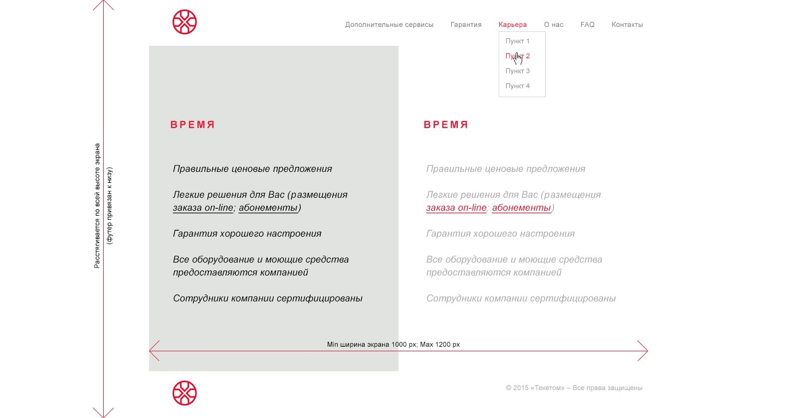

Во вложении - файл с исходниками. Вам необходимо сделать простую верстку по макету, а так же написать простенький класс, для отправки email. Описание ниже.

## Задание по HTML

Тестовое задание по HTML заключается в реализации простого макета (см. test)

Необходимо учесть следующие вещи:

Минимальная ширина контента 1000px
Максимальная ширина контента 1200px
Фон центральной части растягивается по всей высоте экрана
Футер привязан к низу экрана в случае, если контент не достигает конца страницы, в противном случае футер уходит за границы окна браузера и появляется полоса прокрутки.
Пункты меню изменяют цвет при наведении на них
Мы не приветствуем использование фреймворков и сборщиков в верстке, максимум это использование jQuery и легковесных плагинов к нему
Желательно минимальное использование js

Рекомендуемые источники информации для выполнения задания:

htmlbook.ru
habrahabr.ru
ruseller.com
поисковики google и yandex
Рекомендуемые статьи:

`http://htmlbook.ru/samlayout/blochnaya-verstka`
`http://htmlbook.ru/samlayout/tipovye-makety`

## Задание по PHP 

Задание заключается в разработке класса, который должен отправлять эл. почту по SMTP или через функцию mail().

Класс должен содержать 4 метода:

Метод public Send() - отправка письма. Должен принимать 3 параметра - получатель, заголовок письма, тело письма.
Метод private CheckSmtp() - должен проверять доступность SMTP сервера.
Метод private sendSmtp() - отправлять письмо через SMTP сервер.
Метод private sendMail() - отправлять письмо через функцию mail().

Логика работы следующая - метод Send(), после вызова, должен проверить доступность SMTP сервера, после чего отправить письмо, а в случае, если сервер недоступен - использовать функцию mail().
В качестве почтового сервера можно использовать сервисы Яндекс, Gmail или Mail.Ru.

Рекомендуемые источники информации для выполнения задания:
`php.su`
`habrahabr.ru`
`php.net`